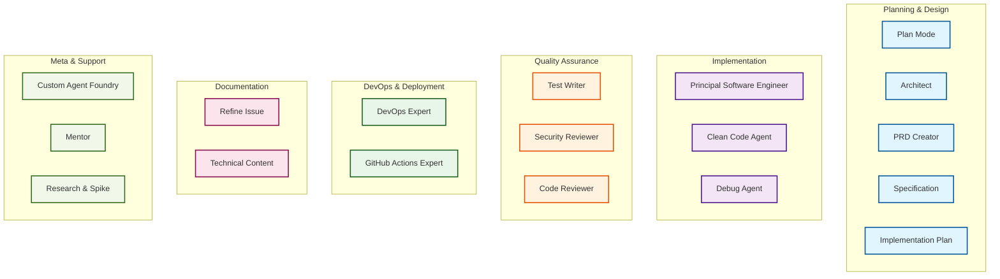
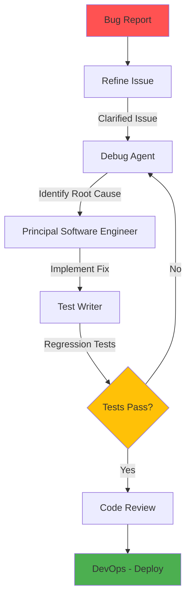
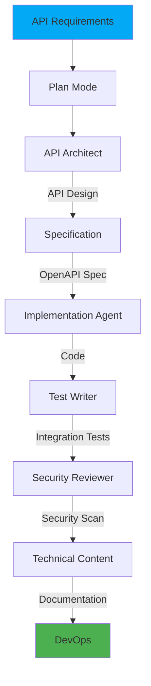
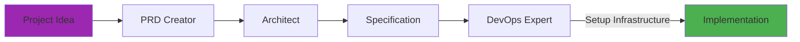
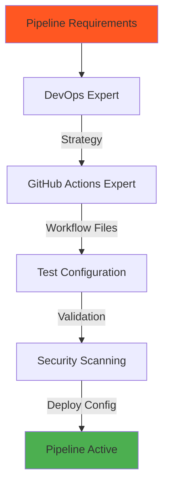
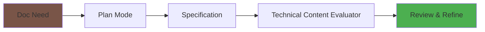
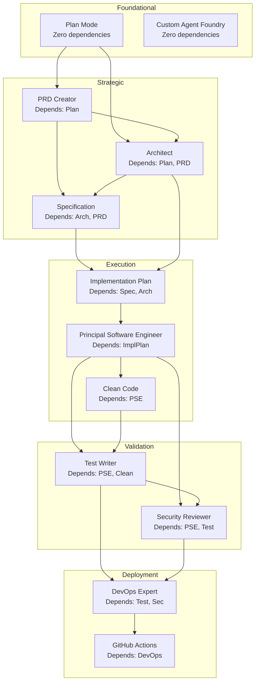

This document visualizes the relationships between custom agents and defines logical workflow sequences for common development tasks.

## Agent Ecosystem Overview



---

## Workflow 1: Feature Development (Complete Cycle)

### Requirements
- **REQ-001**: All features must begin with planning and requirements documentation before implementation
- **REQ-002**: Technical specifications must be created from approved PRDs before architectural design
- **REQ-003**: Architecture decisions must be documented and reviewed before implementation planning
- **REQ-004**: Implementation must include automated tests with minimum 80% code coverage
- **REQ-005**: Security review must be performed before deployment
- **REQ-006**: DevOps deployment strategy must be defined and tested

### Acceptance Criteria
- **AC-001**: Given a user request, When Plan Mode completes research, Then a comprehensive PRD must be created with all requirements documented
- **AC-002**: Given a PRD, When Specification agent completes, Then technical specifications must include all interfaces, data contracts, and constraints
- **AC-003**: Given technical specifications, When Architect completes design, Then architecture decisions must be documented with ADRs
- **AC-004**: Given architecture decisions, When Implementation Plan is created, Then all tasks must be sequenced with dependencies identified
- **AC-005**: Given implementation completion, When Test Writer completes, Then all acceptance criteria must have corresponding automated tests
- **AC-006**: Given security review completion, When no critical vulnerabilities exist, Then deployment can proceed
- **AC-007**: Given deployment completion, When monitoring is active, Then the feature is considered complete


### Handoff Chain
1. **Plan** → `"Create PRD"` → **PRD Creator**
2. **PRD** → `"Generate Specification"` → **Specification**
3. **Specification** → `"Design Architecture"` → **Architect**
4. **Architect** → `"Create Implementation Plan"` → **Implementation Plan**
5. **Implementation Plan** → `"Begin Implementation"` → **Principal Software Engineer**
6. **PSE** → `"Add Tests"` → **Test Writer**
7. **Test Writer** → `"Security Review"` → **Security Reviewer**
8. **Security** → `"Setup Deployment"` → **DevOps Expert**

### Completion Definition
The feature development workflow is complete when: (1) Code is deployed to production, (2) All acceptance criteria tests pass, (3) Security review has zero critical findings, (4) Monitoring dashboards are active and showing healthy metrics, (5) Documentation is published

### Validation Steps
1. Verify PRD includes all stakeholder requirements and success criteria
2. Confirm technical specification aligns with PRD and includes all necessary interfaces
3. Review architecture decisions for scalability, maintainability, and alignment with system standards
4. Validate implementation plan covers all specification requirements with realistic estimates
5. Execute all automated tests and confirm 80%+ code coverage
6. Run security scanner and address all critical/high severity findings
7. Perform smoke tests in staging environment before production deployment
8. Verify monitoring alerts and dashboards are configured and functional

---

## Workflow 2: Bug Fix & Debugging

### Requirements
- **REQ-007**: All bugs must be clearly documented with reproduction steps before debugging
- **REQ-008**: Root cause analysis must be documented before implementing fixes
- **REQ-009**: Bug fixes must include regression tests to prevent recurrence
- **REQ-010**: Critical bugs must have hotfix deployment path with expedited review
- **REQ-011**: Bug fix validation must include testing in environment matching production

### Acceptance Criteria
- **AC-008**: Given a bug report, When Refine Issue completes, Then the issue must include reproduction steps, expected vs actual behavior, and severity level
- **AC-009**: Given a clarified issue, When Debug Agent completes analysis, Then root cause must be identified with supporting evidence
- **AC-010**: Given root cause identification, When PSE implements fix, Then the fix must address the root cause without introducing side effects
- **AC-011**: Given fix implementation, When Test Writer completes, Then regression tests must verify bug is fixed and prevent future occurrences
- **AC-012**: Given passing tests, When Code Review completes, Then fix must meet quality standards before deployment
- **AC-013**: Given deployment completion, When bug is verified in production, Then the issue can be closed



### Handoff Chain
1. **Refine Issue** → `"Debug this issue"` → **Debug Agent**
2. **Debug** → `"Implement fix"` → **Principal Software Engineer**
3. **PSE** → `"Add regression tests"` → **Test Writer**
4. **Test Writer** → `"Deploy fix"` → **DevOps Expert**

### Completion Definition
The bug fix workflow is complete when: (1) Root cause is documented, (2) Fix is implemented and code reviewed, (3) Regression tests pass in all environments, (4) Fix is deployed and verified in production, (5) Issue is updated with resolution details and closed

### Validation Steps
1. Confirm bug reproduction steps work consistently before fix
2. Verify root cause analysis identifies underlying issue, not just symptoms
3. Test fix in isolated environment before integration
4. Execute regression test suite and confirm bug no longer reproduces
5. Verify fix doesn't introduce performance degradation or new bugs
6. Deploy to staging and verify fix before production deployment
7. Monitor production for 24 hours post-deployment to ensure stability

---

## Workflow 3: Refactoring & Modernization

### Requirements
- **REQ-012**: Code assessment must identify technical debt, anti-patterns, and modernization opportunities
- **REQ-013**: Refactoring must maintain existing functionality without breaking changes
- **REQ-014**: All refactoring changes must be covered by tests before and after modifications
- **REQ-015**: Modernization strategy must include risk assessment and rollback plan
- **REQ-016**: Clean code principles must be applied consistently across refactored codebase

### Acceptance Criteria
- **AC-014**: Given code assessment completion, When Plan Mode completes analysis, Then technical debt items must be prioritized by impact and effort
- **AC-015**: Given prioritized technical debt, When Architect creates modernization strategy, Then the strategy must include incremental steps minimizing risk
- **AC-016**: Given modernization strategy, When Implementation Plan is created, Then each refactoring step must have clear before/after states
- **AC-017**: Given implementation plan, When Clean Code Agent completes refactoring, Then code must follow language-specific best practices and patterns
- **AC-018**: Given refactored code, When Test Writer updates tests, Then all existing tests must pass and code coverage must not decrease
- **AC-019**: Given test completion, When Code Review validates changes, Then refactored code must be more maintainable than original


### Handoff Chain
1. **Plan** → `"Design modernization approach"` → **Architect**
2. **Architect** → `"Create refactoring plan"` → **Implementation Plan**
3. **Implementation Plan** → `"Apply clean code principles"` → **Clean Code Agent**
4. **Clean Code** → `"Update test coverage"` → **Test Writer**

### Completion Definition
The refactoring workflow is complete when: (1) All planned refactoring tasks are completed, (2) Code quality metrics show measurable improvement, (3) All tests pass with maintained or improved coverage, (4) Code review confirms improved maintainability, (5) Changes are deployed without incidents

### Validation Steps
1. Run static code analysis before and after refactoring to measure improvement
2. Verify all existing tests pass before making changes
3. Execute full regression test suite after each refactoring increment
4. Compare code complexity metrics (cyclomatic complexity, maintainability index) before/after
5. Confirm no functional changes through integration testing
6. Review code for consistent application of clean code principles
7. Validate performance hasn't degraded using benchmarks

---

## Workflow 4: API Development

### Requirements
- **REQ-017**: API design must follow RESTful principles or GraphQL best practices as appropriate
- **REQ-018**: All APIs must have OpenAPI/Swagger specifications before implementation
- **REQ-019**: API contracts must be versioned with backward compatibility strategy
- **REQ-020**: APIs must include authentication, authorization, and rate limiting
- **REQ-021**: API documentation must include examples, error codes, and response schemas
- **REQ-022**: Integration tests must validate all API endpoints and error conditions

### Acceptance Criteria
- **AC-020**: Given API requirements, When Plan Mode completes, Then use cases and integration patterns must be documented
- **AC-021**: Given documented use cases, When API Architect completes design, Then API must follow consistent naming, versioning, and response patterns
- **AC-022**: Given API design, When Specification creates OpenAPI spec, Then all endpoints, schemas, and error responses must be defined
- **AC-023**: Given OpenAPI specification, When PSE implements API, Then implementation must match specification exactly
- **AC-024**: Given API implementation, When Test Writer creates tests, Then integration tests must cover all endpoints, status codes, and edge cases
- **AC-025**: Given test completion, When Security Reviewer completes audit, Then authentication, authorization, and input validation must meet security standards
- **AC-026**: Given security approval, When Technical Content documents API, Then documentation must be complete, accurate, and include working examples



### Handoff Chain
1. **Plan** → `"Design API"` → **API Architect**
2. **API Architect** → `"Create specification"` → **Specification**
3. **Specification** → `"Implement API"` → **Principal Software Engineer**
4. **PSE** → `"Add integration tests"` → **Test Writer**
5. **Test Writer** → `"Security review"` → **Security Reviewer**
6. **Security** → `"Document API"` → **Technical Content**
7. **Documentation** → `"Setup CI/CD"` → **DevOps Expert**

### Completion Definition
The API development workflow is complete when: (1) OpenAPI specification is published, (2) All endpoints are implemented and tested, (3) Security review passes with no critical findings, (4) API documentation is published and accessible, (5) CI/CD pipeline is configured and operational

### Validation Steps
1. Validate API design against REST/GraphQL best practices
2. Use OpenAPI validator to confirm specification compliance
3. Test all endpoints using automated integration tests with various payloads
4. Verify authentication and authorization for protected endpoints
5. Test rate limiting and throttling mechanisms
6. Validate error responses match documented error codes
7. Perform load testing to verify performance under expected traffic
8. Review API documentation for completeness and accuracy with QA team

---

## Workflow 5: New Project Setup

### Requirements
- **REQ-023**: New projects must start with comprehensive PRD defining goals, scope, and success criteria
- **REQ-024**: System architecture must be designed before infrastructure setup
- **REQ-025**: Technical specifications must define all major components and their interactions
- **REQ-026**: DevOps infrastructure must include CI/CD, monitoring, and logging from day one
- **REQ-027**: Project structure must follow language/framework conventions and team standards
- **REQ-028**: Initial implementation must include example code, tests, and documentation templates

### Acceptance Criteria
- **AC-027**: Given a project idea, When PRD Creator completes, Then PRD must include goals, target users, success metrics, and initial scope
- **AC-028**: Given approved PRD, When Architect completes design, Then architecture must define technology stack, system components, data flow, and integration points
- **AC-029**: Given architecture design, When Specification creates technical spec, Then spec must include project structure, coding standards, dependencies, and deployment requirements
- **AC-030**: Given technical specification, When DevOps Expert sets up infrastructure, Then CI/CD pipelines, environments (dev/staging/prod), monitoring, and logging must be operational
- **AC-031**: Given infrastructure setup, When Implementation begins, Then project must have working build, passing tests, and deployable artifact
- **AC-032**: Given initial implementation, When validation completes, Then team must be able to clone, build, test, and deploy the project successfully



### Handoff Chain
1. **PRD Creator** → `"Design system architecture"` → **Architect**
2. **Architect** → `"Create technical specification"` → **Specification**
3. **Specification** → `"Setup DevOps infrastructure"` → **DevOps Expert**

### Completion Definition
The new project setup workflow is complete when: (1) Repository is created with standard structure, (2) CI/CD pipelines are functional and passing, (3) All environments are provisioned and accessible, (4) Documentation includes setup instructions and architecture diagrams, (5) Team can successfully onboard and contribute

### Validation Steps
1. Clone repository and verify all dependencies install successfully
2. Run build process and confirm no errors
3. Execute test suite and verify all tests pass
4. Deploy to dev environment and verify application starts correctly
5. Review project structure against language/framework conventions
6. Validate CI/CD pipeline triggers on commits and PRs
7. Confirm monitoring and logging capture application events
8. Test onboarding documentation with new team member

---

## Workflow 6: CI/CD Pipeline Setup

### Requirements
- **REQ-029**: CI/CD pipelines must include build, test, security scan, and deployment stages
- **REQ-030**: Pipelines must support multiple environments (dev, staging, production) with promotion gates
- **REQ-031**: All deployments must be automated with rollback capabilities
- **REQ-032**: Security scanning must run on every build including dependency vulnerabilities and code analysis
- **REQ-033**: Pipeline configuration must be version-controlled and follow infrastructure-as-code principles
- **REQ-034**: Deployment notifications must be sent to relevant stakeholders

### Acceptance Criteria
- **AC-033**: Given pipeline requirements, When DevOps Expert defines strategy, Then strategy must include build, test, scan, deploy stages with appropriate gates
- **AC-034**: Given DevOps strategy, When GitHub Actions Expert creates workflows, Then workflows must be triggered by appropriate events (push, PR, release)
- **AC-035**: Given workflow files, When Test Configuration is added, Then automated tests must run on every PR and block merge if failing
- **AC-036**: Given test configuration, When Security Scanning is configured, Then scans must identify vulnerabilities and fail build on critical findings
- **AC-037**: Given security configuration, When Deploy Config is completed, Then deployments must be automated with approval gates for production
- **AC-038**: Given complete pipeline, When validation runs, Then full deployment cycle must execute successfully from commit to production



### Handoff Chain
1. **DevOps Expert** → `"Create GitHub Actions workflows"` → **GitHub Actions Expert**
2. **GitHub Actions Expert** → `"Add test configuration"` → **Test Configuration**
3. **Test Configuration** → `"Configure security scanning"` → **Security Scanning**
4. **Security Scanning** → `"Configure deployment"` → **Deploy Config**

### Completion Definition
The CI/CD pipeline setup workflow is complete when: (1) All pipeline stages execute successfully, (2) Automated tests run on every PR, (3) Security scans identify vulnerabilities, (4) Deployments to all environments work without manual intervention, (5) Rollback procedures are tested and documented

### Validation Steps
1. Trigger pipeline with test commit and verify all stages execute
2. Introduce test failure and confirm pipeline fails appropriately
3. Test security scanner by introducing known vulnerability
4. Deploy to dev environment and verify automatic deployment
5. Test staging deployment with approval gate
6. Simulate failed deployment and verify rollback works
7. Confirm notifications are sent for pipeline events
8. Review pipeline logs for clarity and completeness

---

## Workflow 7: Documentation & Content

### Requirements
- **REQ-035**: Documentation must be accurate, complete, and maintained in version control
- **REQ-036**: Technical content must target appropriate audience (developers, operators, end users)
- **REQ-037**: Documentation must include examples, diagrams, and troubleshooting sections
- **REQ-038**: API documentation must be auto-generated from code/specifications where possible
- **REQ-039**: Documentation must follow organization style guide and formatting standards
- **REQ-040**: All documentation must be reviewed for technical accuracy before publishing

### Acceptance Criteria
- **AC-039**: Given documentation need, When Plan Mode identifies scope, Then documentation plan must define audience, content structure, and success criteria
- **AC-040**: Given documentation plan, When Specification creates outline, Then outline must include all necessary sections with clear purpose for each
- **AC-041**: Given documentation outline, When Technical Content creates content, Then content must be clear, accurate, and include working examples
- **AC-042**: Given draft content, When Review & Refine completes, Then documentation must be technically accurate, well-formatted, and follow style guide
- **AC-043**: Given approved documentation, When published, Then users must be able to successfully follow instructions without external help
- **AC-044**: Given published documentation, When feedback is received, Then content must be updated within defined SLA



### Handoff Chain
1. **Plan Mode** → `"Create documentation outline"` → **Specification**
2. **Specification** → `"Create technical content"` → **Technical Content Evaluator**
3. **Technical Content** → `"Review and refine"` → **Code Reviewer** or **Mentor**

### Completion Definition
The documentation workflow is complete when: (1) All planned content sections are written, (2) Technical accuracy is verified by subject matter experts, (3) Examples and code snippets are tested and work correctly, (4) Documentation passes editorial review, (5) Content is published and accessible to target audience

### Validation Steps
1. Review documentation outline against requirements to ensure completeness
2. Verify all code examples compile and execute correctly
3. Test all command-line instructions and verify accuracy
4. Confirm diagrams render correctly and accurately represent architecture
5. Review content for grammar, spelling, and style guide compliance
6. Validate links and references are correct and accessible
7. Test documentation with representative user from target audience
8. Confirm documentation is searchable and properly indexed

---

## Agent Role Categories

### 🎯 Entry Points (User-Facing Agents)
Agents users typically start with:
- **Plan Mode** - Strategic planning and analysis
- **PRD Creator** - Product requirements
- **Refine Issue** - Issue enhancement
- **Debug Agent** - Bug investigation
- **Custom Agent Foundry** - Agent creation

### 🏗️ Architecture & Design
Strategic decision-making:
- **Architect** - System design
- **API Architect** - API design
- **Specification** - Technical specs
- **Implementation Plan** - Execution plans

### 💻 Implementation
Code generation and modification:
- **Principal Software Engineer** - Expert implementation
- **Clean Code Agent** - Code quality
- **Modernization** - Legacy refactoring

### ✅ Quality Assurance
Validation and testing:
- **Test Writer** - Test generation
- **Security Reviewer** - Security analysis
- **Code Review** - Quality checks

### 🚀 DevOps & Deployment
Infrastructure and deployment:
- **DevOps Expert** - Full lifecycle
- **GitHub Actions Expert** - CI/CD workflows

### 📚 Documentation
Content creation:
- **Technical Content Evaluator** - Doc quality
- **ADR Generator** - Decision records

### 🤝 Support & Meta
Assistance and agent management:
- **Mentor** - Guidance and coaching
- **Research & Spike** - Technical investigation
- **Custom Agent Foundry** - Agent creation
- **Demonstrate Understanding** - Knowledge verification

---

## Recommended Handoff Implementations

### High Priority Handoffs (Implement First)

```yaml
# plan.agent.md
handoffs:
  - label: "📋 Create PRD"
    agent: prd
    prompt: "Create a comprehensive PRD for: {{conversation}}"
    send: false
  - label: "📐 Generate Specification"
    agent: specification
    prompt: "Create a technical specification for: {{conversation}}"
    send: false
  - label: "🏗️ Design Architecture"
    agent: architect
    prompt: "Design the architecture for: {{conversation}}"
    send: false

# specification.agent.md
handoffs:
  - label: "📝 Create Implementation Plan"
    agent: implementation-plan
    prompt: "Generate a detailed implementation plan based on this specification"
    send: false
  - label: "🏗️ Review Architecture"
    agent: architect
    prompt: "Review and refine the architecture for this specification"
    send: false

# implementation-plan.agent.md
handoffs:
  - label: "💻 Begin Implementation"
    agent: principal-software-engineer
    prompt: "Implement this plan: {{conversation}}"
    send: false

# principal-software-engineer.agent.md
handoffs:
  - label: "🧪 Add Test Coverage"
    agent: test-writer
    prompt: "Create comprehensive tests for the implementation above"
    send: false
  - label: "🔒 Security Review"
    agent: security-reviewer
    prompt: "Perform a security review of the implementation above"
    send: false
  - label: "✨ Apply Clean Code"
    agent: clean-code
    prompt: "Refactor this code to follow clean code principles: {{conversation}}"
    send: false

# debug.agent.md
handoffs:
  - label: "🧪 Add Regression Tests"
    agent: test-writer
    prompt: "Create tests to prevent regression of the bug fixed above"
    send: false
  - label: "💻 Implement Fix"
    agent: principal-software-engineer
    prompt: "Implement a fix for the root cause identified above"
    send: false

# architect.agent.md
handoffs:
  - label: "📋 Create Specification"
    agent: specification
    prompt: "Create a detailed specification for the architecture decisions outlined above"
    send: false
  - label: "🚀 Setup Infrastructure"
    agent: devops-expert
    prompt: "Setup DevOps infrastructure for this architecture"
    send: false

# prd.agent.md
handoffs:
  - label: "🏗️ Design Architecture"
    agent: architect
    prompt: "Design the system architecture for this PRD"
    send: false
  - label: "📐 Create Specification"
    agent: specification
    prompt: "Create technical specifications for this PRD"
    send: false

# devops-expert.agent.md
handoffs:
  - label: "⚙️ Configure GitHub Actions"
    agent: github-actions-expert
    prompt: "Create GitHub Actions workflows for this DevOps strategy"
    send: false
```

---

## Usage Patterns

### Pattern 1: Full Feature Development
```
User Request 
  → Plan Mode (research & strategize)
  → PRD Creator (document requirements)
  → Specification (technical details)
  → Architect (design decisions)
  → Implementation Plan (execution steps)
  → Principal Software Engineer (code)
  → Test Writer (tests)
  → Security Reviewer (security)
  → DevOps Expert (deploy)
```

### Pattern 2: Quick Bug Fix
```
Bug Report
  → Refine Issue (clarify details)
  → Debug Agent (root cause)
  → Principal Software Engineer (fix)
  → Test Writer (regression tests)
```

### Pattern 3: Code Quality Improvement
```
Code Review Request
  → Plan Mode (assess codebase)
  → Clean Code Agent (refactor)
  → Test Writer (update tests)
  → Review (validate)
```

### Pattern 4: Infrastructure Setup
```
Deployment Need
  → DevOps Expert (strategy)
  → GitHub Actions Expert (workflows)
  → Security Reviewer (security scan)
```

---

## Agent Dependency Map



---

## Agent Selection Guide

### "Which agent should I use?"

| Your Goal | Start With | Then Use |
|-----------|------------|----------|
| 🎯 New feature idea | Plan Mode | → PRD → Specification → Implementation Plan |
| 🐛 Fix a bug | Debug Agent | → Principal Software Engineer → Test Writer |
| 🏗️ Design system | Architect | → Specification → Implementation Plan |
| 📋 Write requirements | PRD Creator | → Specification → Architect |
| 💻 Write code | Principal Software Engineer | → Test Writer → Security Reviewer |
| 🧪 Add tests | Test Writer | (standalone or after implementation) |
| 🔒 Security review | Security Reviewer | → Principal Software Engineer (for fixes) |
| 🚀 Setup deployment | DevOps Expert | → GitHub Actions Expert |
| ✨ Improve code quality | Clean Code Agent | → Test Writer |
| 📚 Create docs | Technical Content | (standalone) |
| 🔧 Create new agent | Custom Agent Foundry | (standalone) |
| 🤔 Research spike | Research Agent | → Plan Mode (with findings) |

---

## Best Practices

### ✅ Do's
- Start with planning agents for complex work
- Use handoffs to create seamless workflows
- Validate with quality agents before deployment
- Document decisions with appropriate agents
- Chain agents logically (Plan → Implement → Test → Deploy)

### ❌ Don'ts
- Skip planning for complex features
- Jump directly to implementation without design
- Deploy without security review
- Forget test coverage
- Create circular dependencies between agents

---

## Future Enhancements

### Potential New Workflows
1. **Performance Optimization**: Plan → Profile → Optimize → Benchmark → Deploy
2. **Migration**: Assess → Plan → Test → Migrate → Validate
3. **Incident Response**: Detect → Debug → Fix → Test → Deploy → Post-Mortem

### Missing Agent Opportunities
- **Performance Analyzer** - Bottleneck identification
- **Migration Specialist** - System migrations
- **Post-Mortem Generator** - Incident documentation
- **Dependency Auditor** - Dependency health checks
- **Load Tester** - Performance testing

---

## Metrics & Success Criteria

### Workflow Efficiency Metrics
- **Time to Implementation**: Plan → Deploy time
- **Handoff Success Rate**: Percentage of successful handoffs
- **Quality Gate Passes**: Security + Test coverage rate
- **Agent Utilization**: Which agents are most/least used

### Quality Indicators
- Issues caught by Security Reviewer before deployment
- Test coverage increase from Test Writer
- Code quality improvement from Clean Code Agent
- Bug resolution time with Debug Agent

---

*Last Updated: January 27, 2026*
*Version: 1.0*
