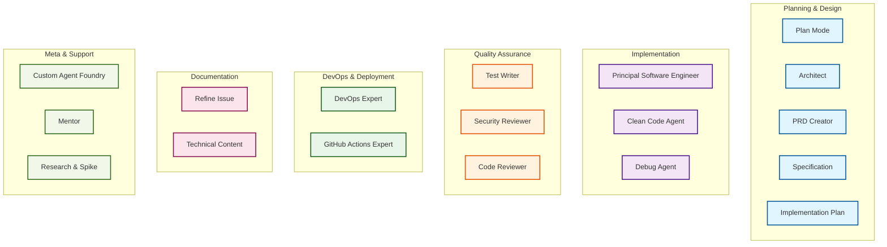
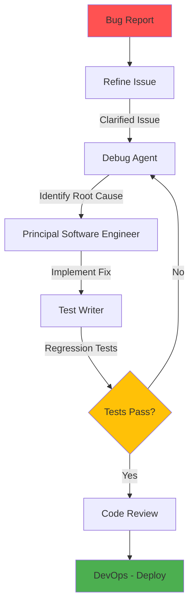
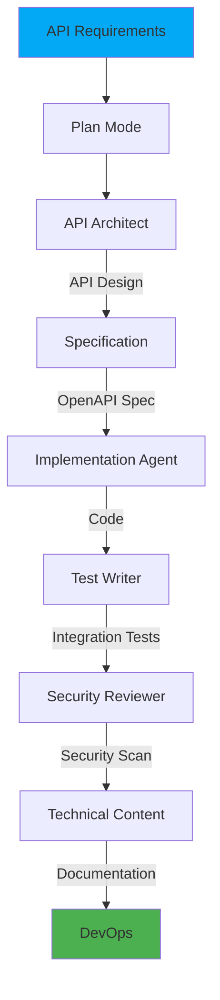
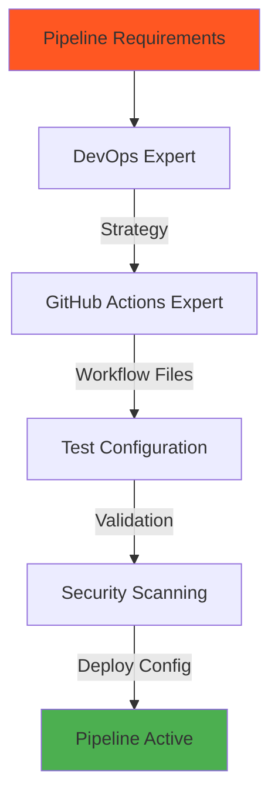
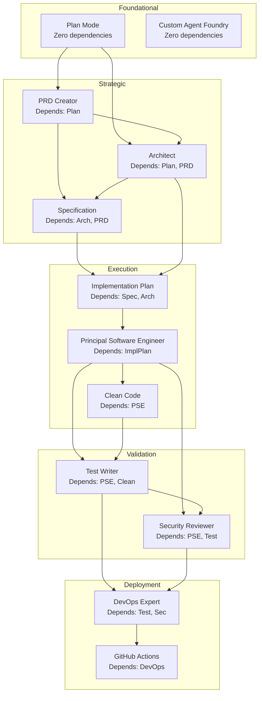

# Custom Agent Workflows & Relationships

This document visualizes the relationships between custom agents and defines logical workflow sequences for common development tasks.

## Agent Ecosystem Overview



---

## Workflow 1: Feature Development (Complete Cycle)


### Handoff Chain
1. **Plan** → `"Create PRD"` → **PRD Creator**
2. **PRD** → `"Generate Specification"` → **Specification**
3. **Specification** → `"Design Architecture"` → **Architect**
4. **Architect** → `"Create Implementation Plan"` → **Implementation Plan**
5. **Implementation Plan** → `"Begin Implementation"` → **Principal Software Engineer**
6. **PSE** → `"Add Tests"` → **Test Writer**
7. **Test Writer** → `"Security Review"` → **Security Reviewer**
8. **Security** → `"Setup Deployment"` → **DevOps Expert**

---

## Workflow 2: Bug Fix & Debugging



### Handoff Chain
1. **Refine Issue** → `"Debug this issue"` → **Debug Agent**
2. **Debug** → `"Implement fix"` → **Principal Software Engineer**
3. **PSE** → `"Add regression tests"` → **Test Writer**
4. **Test Writer** → `"Deploy fix"` → **DevOps Expert**

---

## Workflow 3: Refactoring & Modernization


### Handoff Chain
1. **Plan** → `"Design modernization approach"` → **Architect**
2. **Architect** → `"Create refactoring plan"` → **Implementation Plan**
3. **Implementation Plan** → `"Apply clean code principles"` → **Clean Code Agent**
4. **Clean Code** → `"Update test coverage"` → **Test Writer**

---

## Workflow 4: API Development



### Handoff Chain
1. **Plan** → `"Design API"` → **API Architect**
2. **API Architect** → `"Create specification"` → **Specification**
3. **Specification** → `"Implement API"` → **Principal Software Engineer**
4. **PSE** → `"Add integration tests"` → **Test Writer**
5. **Test Writer** → `"Security review"` → **Security Reviewer**
6. **Security** → `"Document API"` → **Technical Content**
7. **Documentation** → `"Setup CI/CD"` → **DevOps Expert**

---

## Workflow 5: New Project Setup


### Handoff Chain
1. **PRD Creator** → `"Design system architecture"` → **Architect**
2. **Architect** → `"Create technical specification"` → **Specification**
3. **Specification** → `"Setup DevOps infrastructure"` → **DevOps Expert**

---

## Workflow 6: CI/CD Pipeline Setup



### Handoff Chain
1. **DevOps Expert** → `"Create GitHub Actions workflows"` → **GitHub Actions Expert**

---

## Workflow 7: Documentation & Content


---

## Agent Role Categories

### 🎯 Entry Points (User-Facing Agents)
Agents users typically start with:
- **Plan Mode** - Strategic planning and analysis
- **PRD Creator** - Product requirements
- **Refine Issue** - Issue enhancement
- **Debug Agent** - Bug investigation
- **Custom Agent Foundry** - Agent creation

### 🏗️ Architecture & Design
Strategic decision-making:
- **Architect** - System design
- **API Architect** - API design
- **Specification** - Technical specs
- **Implementation Plan** - Execution plans

### 💻 Implementation
Code generation and modification:
- **Principal Software Engineer** - Expert implementation
- **Clean Code Agent** - Code quality
- **Modernization** - Legacy refactoring

### ✅ Quality Assurance
Validation and testing:
- **Test Writer** - Test generation
- **Security Reviewer** - Security analysis
- **Code Review** - Quality checks

### 🚀 DevOps & Deployment
Infrastructure and deployment:
- **DevOps Expert** - Full lifecycle
- **GitHub Actions Expert** - CI/CD workflows

### 📚 Documentation
Content creation:
- **Technical Content Evaluator** - Doc quality
- **ADR Generator** - Decision records

### 🤝 Support & Meta
Assistance and agent management:
- **Mentor** - Guidance and coaching
- **Research & Spike** - Technical investigation
- **Custom Agent Foundry** - Agent creation
- **Demonstrate Understanding** - Knowledge verification

---

## Recommended Handoff Implementations

### High Priority Handoffs (Implement First)

```yaml
# plan.agent.md
handoffs:
  - label: "📋 Create PRD"
    agent: prd
    prompt: "Create a comprehensive PRD for: {{conversation}}"
    send: false
  - label: "📐 Generate Specification"
    agent: specification
    prompt: "Create a technical specification for: {{conversation}}"
    send: false
  - label: "🏗️ Design Architecture"
    agent: architect
    prompt: "Design the architecture for: {{conversation}}"
    send: false

# specification.agent.md
handoffs:
  - label: "📝 Create Implementation Plan"
    agent: implementation-plan
    prompt: "Generate a detailed implementation plan based on this specification"
    send: false
  - label: "🏗️ Review Architecture"
    agent: architect
    prompt: "Review and refine the architecture for this specification"
    send: false

# implementation-plan.agent.md
handoffs:
  - label: "💻 Begin Implementation"
    agent: principal-software-engineer
    prompt: "Implement this plan: {{conversation}}"
    send: false

# principal-software-engineer.agent.md
handoffs:
  - label: "🧪 Add Test Coverage"
    agent: test-writer
    prompt: "Create comprehensive tests for the implementation above"
    send: false
  - label: "🔒 Security Review"
    agent: security-reviewer
    prompt: "Perform a security review of the implementation above"
    send: false
  - label: "✨ Apply Clean Code"
    agent: clean-code
    prompt: "Refactor this code to follow clean code principles: {{conversation}}"
    send: false

# debug.agent.md
handoffs:
  - label: "🧪 Add Regression Tests"
    agent: test-writer
    prompt: "Create tests to prevent regression of the bug fixed above"
    send: false
  - label: "💻 Implement Fix"
    agent: principal-software-engineer
    prompt: "Implement a fix for the root cause identified above"
    send: false

# architect.agent.md
handoffs:
  - label: "📋 Create Specification"
    agent: specification
    prompt: "Create a detailed specification for the architecture decisions outlined above"
    send: false
  - label: "🚀 Setup Infrastructure"
    agent: devops-expert
    prompt: "Setup DevOps infrastructure for this architecture"
    send: false

# prd.agent.md
handoffs:
  - label: "🏗️ Design Architecture"
    agent: architect
    prompt: "Design the system architecture for this PRD"
    send: false
  - label: "📐 Create Specification"
    agent: specification
    prompt: "Create technical specifications for this PRD"
    send: false

# devops-expert.agent.md
handoffs:
  - label: "⚙️ Configure GitHub Actions"
    agent: github-actions-expert
    prompt: "Create GitHub Actions workflows for this DevOps strategy"
    send: false
```

---

## Usage Patterns

### Pattern 1: Full Feature Development
```
User Request 
  → Plan Mode (research & strategize)
  → PRD Creator (document requirements)
  → Specification (technical details)
  → Architect (design decisions)
  → Implementation Plan (execution steps)
  → Principal Software Engineer (code)
  → Test Writer (tests)
  → Security Reviewer (security)
  → DevOps Expert (deploy)
```

### Pattern 2: Quick Bug Fix
```
Bug Report
  → Refine Issue (clarify details)
  → Debug Agent (root cause)
  → Principal Software Engineer (fix)
  → Test Writer (regression tests)
```

### Pattern 3: Code Quality Improvement
```
Code Review Request
  → Plan Mode (assess codebase)
  → Clean Code Agent (refactor)
  → Test Writer (update tests)
  → Review (validate)
```

### Pattern 4: Infrastructure Setup
```
Deployment Need
  → DevOps Expert (strategy)
  → GitHub Actions Expert (workflows)
  → Security Reviewer (security scan)
```

---

## Agent Dependency Map



---

## Agent Selection Guide

### "Which agent should I use?"

| Your Goal | Start With | Then Use |
|-----------|------------|----------|
| 🎯 New feature idea | Plan Mode | → PRD → Specification → Implementation Plan |
| 🐛 Fix a bug | Debug Agent | → Principal Software Engineer → Test Writer |
| 🏗️ Design system | Architect | → Specification → Implementation Plan |
| 📋 Write requirements | PRD Creator | → Specification → Architect |
| 💻 Write code | Principal Software Engineer | → Test Writer → Security Reviewer |
| 🧪 Add tests | Test Writer | (standalone or after implementation) |
| 🔒 Security review | Security Reviewer | → Principal Software Engineer (for fixes) |
| 🚀 Setup deployment | DevOps Expert | → GitHub Actions Expert |
| ✨ Improve code quality | Clean Code Agent | → Test Writer |
| 📚 Create docs | Technical Content | (standalone) |
| 🔧 Create new agent | Custom Agent Foundry | (standalone) |
| 🤔 Research spike | Research Agent | → Plan Mode (with findings) |

---

## Best Practices

### ✅ Do's
- Start with planning agents for complex work
- Use handoffs to create seamless workflows
- Validate with quality agents before deployment
- Document decisions with appropriate agents
- Chain agents logically (Plan → Implement → Test → Deploy)

### ❌ Don'ts
- Skip planning for complex features
- Jump directly to implementation without design
- Deploy without security review
- Forget test coverage
- Create circular dependencies between agents

---

## Future Enhancements

### Potential New Workflows
1. **Performance Optimization**: Plan → Profile → Optimize → Benchmark → Deploy
2. **Migration**: Assess → Plan → Test → Migrate → Validate
3. **Incident Response**: Detect → Debug → Fix → Test → Deploy → Post-Mortem

### Missing Agent Opportunities
- **Performance Analyzer** - Bottleneck identification
- **Migration Specialist** - System migrations
- **Post-Mortem Generator** - Incident documentation
- **Dependency Auditor** - Dependency health checks
- **Load Tester** - Performance testing

---

## Metrics & Success Criteria

### Workflow Efficiency Metrics
- **Time to Implementation**: Plan → Deploy time
- **Handoff Success Rate**: Percentage of successful handoffs
- **Quality Gate Passes**: Security + Test coverage rate
- **Agent Utilization**: Which agents are most/least used

### Quality Indicators
- Issues caught by Security Reviewer before deployment
- Test coverage increase from Test Writer
- Code quality improvement from Clean Code Agent
- Bug resolution time with Debug Agent

---

*Last Updated: January 27, 2026*
*Version: 1.0*
