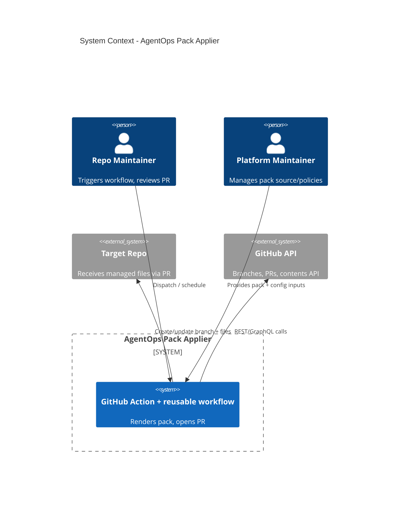

# AgentOps Pack Applier - System Context

## System Overview
GitHub Actions-driven automation that applies and maintains a standardized Copilot/AgentOps pack (Markdown/YAML) in target repos via PRs, with safety mechanisms for idempotence and managed sections.

## Context Diagram

## External Integrations
- **GitHub API (REST/GraphQL)**: branch creation, contents updates, PR creation/update.
- **GitHub Actions runners**: execution environment (ubuntu-latest default).

## High-Level Constraints
- PR-only by default; no force-push unless explicitly configured.
- Use GITHUB_TOKEN where possible; optional PAT/App token for cross-repo.
- No secrets written to logs or generated files.

## Key NFR Goals
- Idempotent re-runs (zero diff when no source change).
- Stable, low-noise diffs (no volatile timestamps/order).
- Runtime target <10m (goal <5m) for base pack.