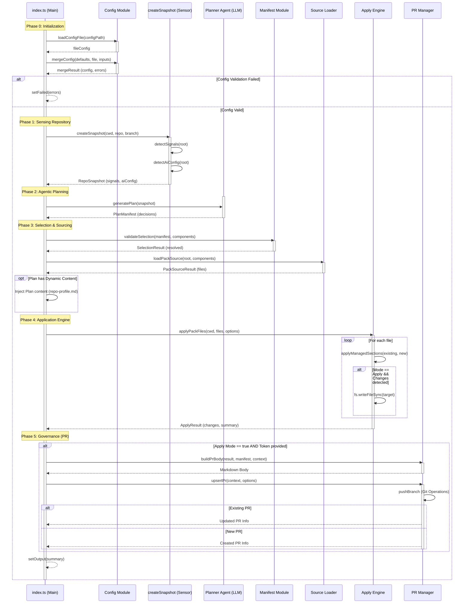

```mermaid
sequenceDiagram
    participant Main as index.ts (Main)
    participant Config as Config Module
    participant Sensor as createSnapshot (Sensor)
    participant Planner as Planner Agent (LLM)
    participant Manifest as Manifest Module
    participant Source as Source Loader
    participant Engine as Apply Engine
    participant PR as PR Manager

    Note over Main: Phase 0: Initialization
    activate Main
    Main->>Config: loadConfigFile(configPath)
    activate Config
    Config-->>Main: fileConfig
    deactivate Config

    Main->>Config: mergeConfig(defaults, file, inputs)
    activate Config
    Config-->>Main: mergeResult (config, errors)
    deactivate Config

    alt Config Validation Failed
        Main-->>Main: setFailed(errors)
    else Config Valid
        Note over Main: Phase 1: Sensing Repository
        Main->>Sensor: createSnapshot(cwd, repo, branch)
        activate Sensor
        Sensor->>Sensor: detectSignals(root)
        Sensor->>Sensor: detectAiConfig(root)
        Sensor-->>Main: RepoSnapshot (signals, aiConfig)
        deactivate Sensor

        Note over Main: Phase 2: Agentic Planning
        activate Planner
        Main->>Planner: generatePlan(snapshot)
        Planner-->>Main: PlanManifest (decisions)
        deactivate Planner

        Note over Main: Phase 3: Selection & Sourcing
        Main->>Manifest: validateSelection(manifest, components)
        activate Manifest
        Manifest-->>Main: SelectionResult (resolved)
        deactivate Manifest

        Main->>Source: loadPackSource(root, components)
        activate Source
        Source-->>Main: PackSourceResult (files)
        deactivate Source

        opt Plan has Dynamic Content
            Main->>Main: Inject Plan content (repo-profile.md)
        end

        Note over Main: Phase 4: Application Engine
        Main->>Engine: applyPackFiles(cwd, files, options)
        activate Engine
        
        loop For each file
            Engine->>Engine: applyManagedSections(existing, new)
            alt Mode == Apply && Changes detected
                Engine->>Engine: fs.writeFileSync(target)
            end
        end

        Engine-->>Main: ApplyResult (changes, summary)
        deactivate Engine

        Note over Main: Phase 5: Governance (PR)
        alt Apply Mode == true AND Token provided
            Main->>PR: buildPrBody(result, manifest, context)
            activate PR
            PR-->>Main: Markdown Body
            deactivate PR

            Main->>PR: upsertPr(context, options)
            activate PR
            PR->>PR: pushBranch (Git Operations)
            alt Existing PR
                PR-->>Main: Updated PR Info
            else New PR
                PR-->>Main: Created PR Info
            end
            deactivate PR
        end

        Main-->>Main: setOutput(summary)
    end
    deactivate Main
```